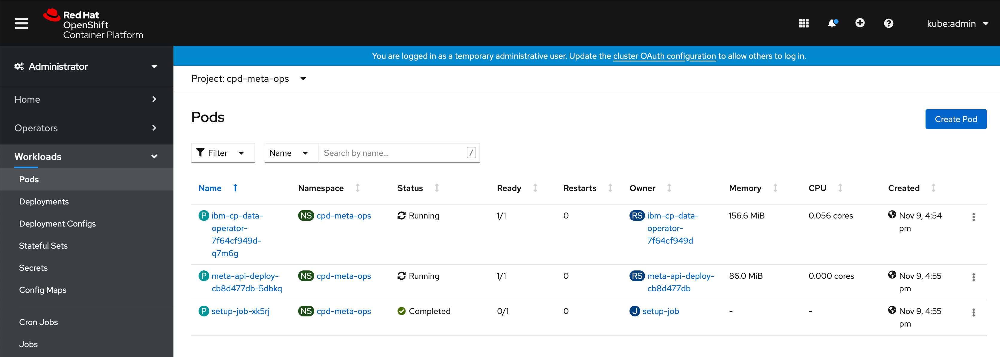
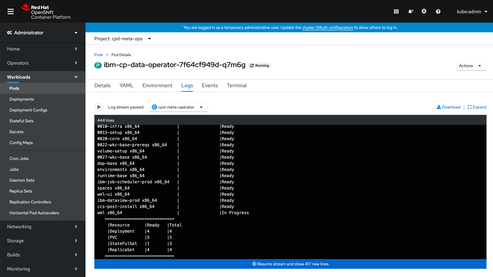

### Checking the cp4d service installation status:
* To check the cp4d service installation status, follow these steps:
  1. Click on the openshift console url and login with the `openshift-username` and `openshift-password` that you provided in the `variables.tf` file.
  2. From top of the ocp console window change the current project to `cpd-meta-ops`:
  
  3. On the left hand side of the ocp console window go to Workloads --> Pods:
  
  4. Click on the Operator pod which will be in the format `ibm-cp-data-operator-*` and select the `Logs` tab, here you can see the current cp4d services installation logs:
   
* openshift console will not display all the older logs, so to get the complete cloud pak for data installation log, follow these steps:
  1. ssh to bootnode machine and change current project to `cpd-meta-ops`.
  2. list all the pods running in `cpd-meta-ops` namespace
    ```
    $ oc get pods
      NAME                                    READY   STATUS      RESTARTS   AGE
      ibm-cp-data-operator-7f64cf949d-q7m6g   1/1     Running     0          18h
      meta-api-deploy-cb8d477db-5dbkq         1/1     Running     0          18h
      setup-job-xk5rj                         0/1     Completed   0          18h
  ```
  3. execute this command to save the installation log to a log file, example cpd-log.
    ```
    # Change the operator pod name here
    oc logs ibm-cp-data-operator-7f64cf949d-q7m6g > cpd-log
    ```
  4. scp this cpd-log to your local system.
  
